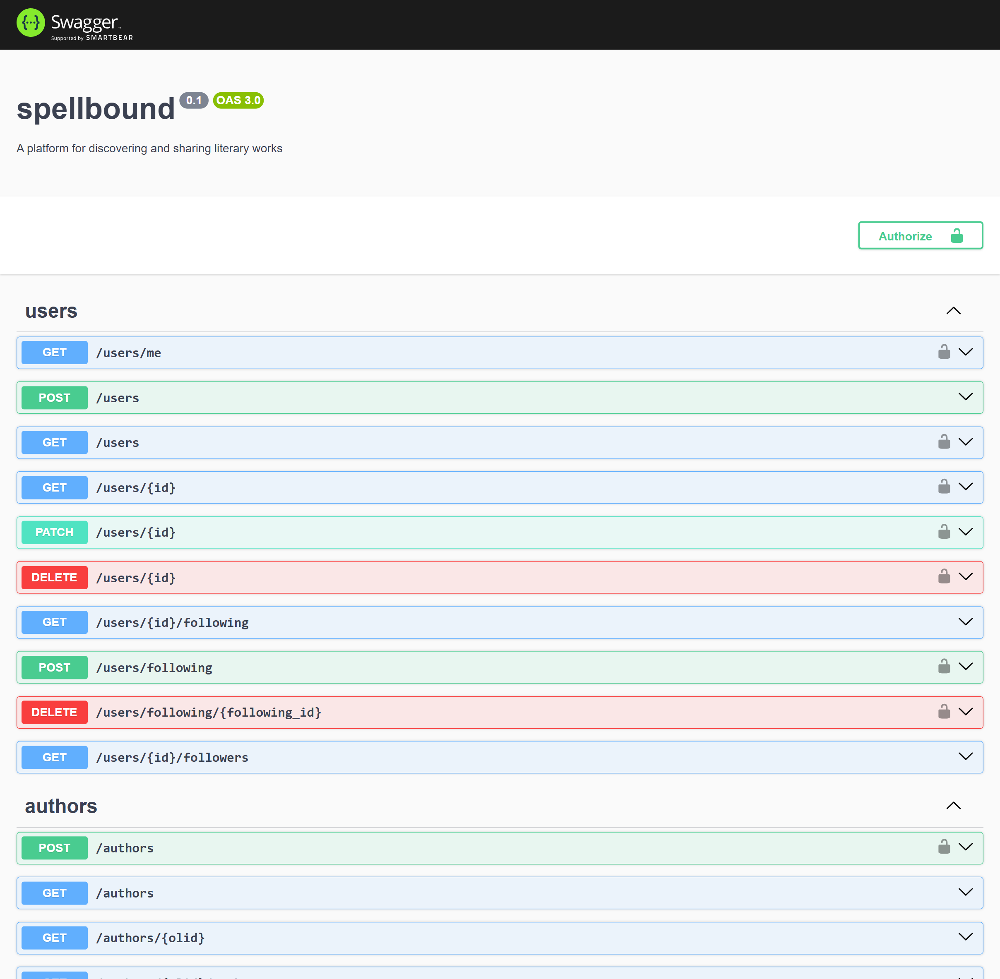

This repo is the backend codebase for [spellbound](https://github.com/spellboundreads/), a responsive, modern web application for discovering, reviewing, and tracking books. Built with **NestJS**. 

## Local Development Setup
1. Clone the repository
```bash
git clone https://github.com/spellboundreads/backend
cd backend
```

2. Install dependencies and start the development server
```bash
npm install
npm run start:dev
```

## Swagger API Documentation
The API documentation is available at `/api` endpoint when the server is running. 



## Deployment
The PostgreSQL database is deployed using **NeonDB**. This project is currently deployed on an **AWS EC2** instance.
